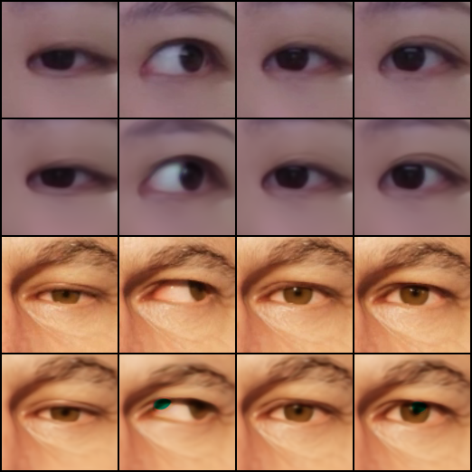
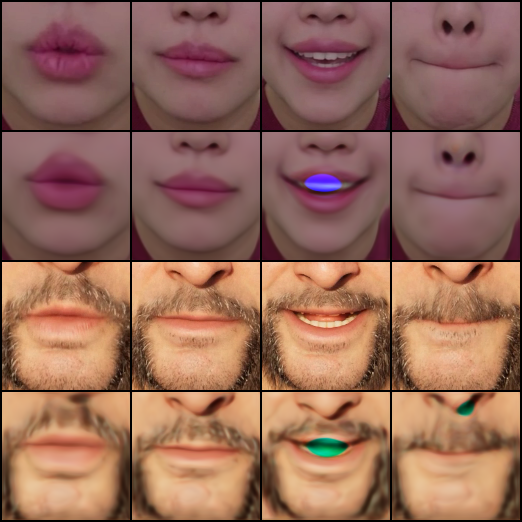
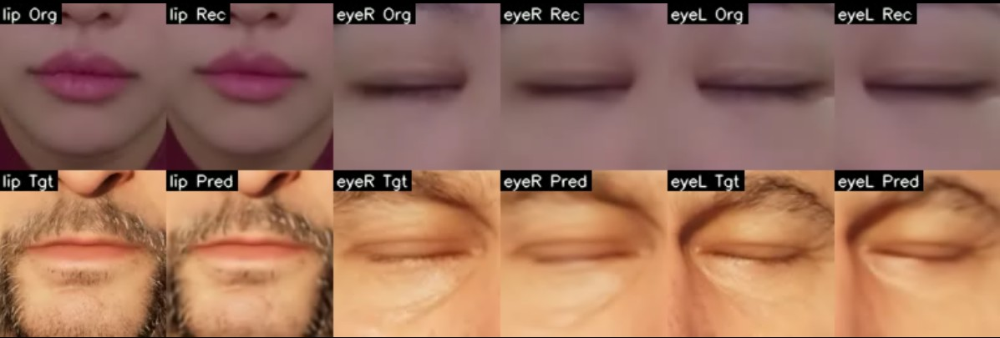

# Local Patch Facial Retargeting Paper Reproduction (LPRR)

This repository is a **personal research reproduction project** based on the paper  
**“Deep-Learning-Based Facial Retargeting Using Local Patches”**.

The goal is to faithfully reproduce the **core pipeline and ideas of the paper** with a simplified setup:
- single performer
- single target character (MetaHuman)
- reduced data scale
- focus on understanding and implementation, not optimization or extension

---

## Project Overview

The original paper proposes a **local-patch-based facial retargeting pipeline** composed of three main modules:

1. **APEM (Automatic Patch Extraction Module)**  
   Extracts and aligns local facial patches (lip, left eye, right eye).

2. **RM (Reenactment Module)**  
   Patch-wise autoencoder that reenacts source expressions in the target character’s appearance.

3. **WEM (Weight Estimation Module)**  
   Regresses reenacted patches into **PCA-compressed blendshape weights** for rig control.

This repository follows the same modular structure and training order.

---

## Current Status

- ✅ APEM implemented (MediaPipe FaceMesh-based patch extraction)
- ✅ RM implemented and trained **per patch** (lip / eye_L / eye_R)
- ✅ RM preview video generation (temporal visualization)
- ✅ WEM implementation 
- ✅ PCA data generation

---

## Directory Structure
```
lprr_project/
├─ data/
│  ├─ source/                 # Source actor patch images
│  │  ├─ patch_lip/
│  │  ├─ patch_eye_l/
│  │  └─ patch_eye_r/
│  │
│  ├─ target/                 # Target character (MetaHuman) patch images
│  │  ├─ patch_lip/
│  │  ├─ patch_eye_l/
│  │  └─ patch_eye_r/
│  │
│  └─ pca/                    # PCA assets (generated via DCC)
│     ├─ pca_basis.npy
│     ├─ pca_mean.npy
│     └─ pca_weight.npy
│
├─ code/
│  ├─ apem/                   # Patch extraction & alignment
│  │  ├─ extract_patches.py
│  │  └─ __init__.py
│  │
│  ├─ rm/                     # Reenactment Module
│  │  ├─ models/
│  │  │  └─ autoencoder.py
│  │  ├─ datasets/
│  │  │  └─ patch_dataset.py
│  │  ├─ train_lip.py         # RM training (lip)
│  │  ├─ train_eye_l.py       # RM training (left eye)
│  │  ├─ train_eye_r.py       # RM training (right eye)
│  │  ├─ video_preview.py           # RM video preview generator
│  │  └─ __init__.py
│  │
│  ├─ wem/                    # Weight Estimation Module (WIP)
│  │  ├─ models/
│  │  ├─ train.py
│  │  ├─ infer.py
│  │  └─ __init__.py
│  │
│  └─ utils/                  # Shared utilities
│     ├─ image.py
│     ├─ video.py
│     └─ __init__.py
│
├─ checkpoints/               # Trained model checkpoints
│  ├─ rm_lip/
│  ├─ rm_eye_l/
│  └─ rm_eye_r/
│
├─ samples/                   # Training sample outputs (4-row grids)
│  ├─ rm_lip/
│  ├─ rm_eye_l/
│  └─ rm_eye_r/
│
├─ runs/                      # Experiment logs (optional)
└─ README.md
```


---

## RM (Reenactment Module) Details

### Training Strategy
- RM is trained **independently per local patch**:
  - lip
  - left eye
  - right eye
- All patches share the **same autoencoder architecture**
- Training is repeated with different datasets, checkpoints, and outputs

### Loss Function
- L1 loss
- SSIM loss  
(as described in the paper)

### Output Visualization
Each RM training script saves 4-row sample images: 
<br>
[source]
[source reconstruction]
[target]
[reenacted target]

<p align="center">
  
  
</p>


These samples are also assembled into **temporal preview videos** for debugging stability and alignment.

---

## RM Preview Video

Sample preview videos are included in this repository.

#### ▶ click image below to Download / Watch RM Preview
[](samples/rm_preview_lip_eyeR_eyeL.mp4)


Each frame shows:
- lip / left eye / right eye patches side by side
- per patch:
source → reconstruction → target → reenacted target

The preview is used to:
- validate temporal consistency
- detect alignment drift
- verify patch-specific RM behavior

---

## WEM (Weight Estimation Module)

WEM maps reenacted local facial patches to **PCA-compressed facial control weights**, following the formulation in the original paper.

### PCA-based Supervision

To construct the regression target space, PCA is applied directly to the **target character’s facial control curves**.

- Target-side facial animation is exported from a MetaHuman character
- Engine-level facial control curves are used  
  (`CTRL_expressions_*`, 260 dimensions per frame)
- PCA reduces the control space from **260 → 32 dimensions**
- Generated PCA assets:
  - `pca_basis.npy`
  - `pca_mean.npy`
  - `pca_weight.npy`

This design ensures that WEM predicts weights in the **exact control space used by the runtime facial rig**, avoiding ambiguity between ARKit, blendshape, or intermediate representations.

### WEM Model

**Input**
- Reenacted target patches from RM:
  - lip
  - left eye
  - right eye
- Patches are channel-concatenated  
  (9 × 128 × 128)

**Output**
- PCA weight vector (32-dimensional)

**Architecture**
- Convolutional encoder
- MLP-based regression head

**Training**
- Supervised regression using PCA weights as ground truth
- Loss: Mean Squared Error (MSE)
- Stable train/validation convergence confirmed

### End-to-End Verification

The full inference pipeline has been validated numerically:
RM reenacted patches
→ WEM regression
→ PCA weight prediction
→ PCA inverse transform
→ Full 260-dim facial control curve reconstruction

Predicted control curves exhibit correct value ranges, temporal continuity, and strict frame alignment with RM outputs.

Visualization focuses on numerical and structural validation rather than final character rendering.


---

## Notes

- This project prioritizes **paper-faithful reproduction**, not performance tuning.
- Local patch size is fixed to **128×128**, following the paper.
- Latent vectors are **not directly used** for regression (paper ablation result).
- Head pose retargeting is intentionally excluded.

---

## Reference

**Deep-Learning-Based Facial Retargeting Using Local Patches**  
https://doi.org/10.1111/cgf.15263

---

## Disclaimer

This is a non-commercial, educational reproduction project.  
All assets are used solely for research and demonstration purposes.


